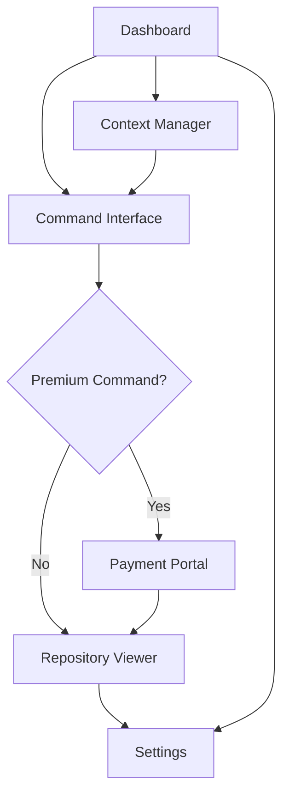

# Scout.New / Conductor 2.0 - Product Requirements Document

## 1. Product Overview
Scout.New (Conductor 2.0) is a multi-context, command-driven agent platform that enables developers to upload various contexts (Markdown, XML, PDF, Images, Repository Links), execute slash commands to trigger AI workflows, and manage repository changes with integrated Solana blockchain payments for premium features.

The platform solves the complexity of managing multiple development contexts and automating workflows through AI agents, targeting developers and development teams who need streamlined context management and automated code operations with blockchain-based premium features.

## 2. Core Features

### 2.1 User Roles
| Role | Registration Method | Core Permissions |
|------|---------------------|------------------|
| Developer | Firebase Auth (Google/Email) | Upload contexts, run basic slash commands, view diffs |
| Premium Developer | Payment verification via Solana | Access premium commands (/deploy, /large refactor), unlimited contexts |

### 2.2 Feature Module
Our Scout.New platform consists of the following main pages:
1. **Dashboard**: workspace overview, context summary, recent commands, payment balance display
2. **Context Manager**: multi-format file upload, context organization, workspace management
3. **Command Interface**: slash command input, AI agent execution, real-time progress tracking
4. **Repository Viewer**: file browser, inline diff viewer, commit approval interface
5. **Payment Portal**: Solana wallet connection, token selection (SOL/USDC/WAGUS), transaction history
6. **Settings**: user preferences, API key management, workspace configuration

### 2.3 Page Details
| Page Name | Module Name | Feature description |
|-----------|-------------|---------------------|
| Dashboard | Workspace Overview | Display active workspaces, recent activity, context count, payment balance |
| Dashboard | Quick Actions | Access frequently used slash commands, recent contexts, payment shortcuts |
| Context Manager | File Upload | Support Markdown, XML, PDF, Images, Repository Links with drag-and-drop interface |
| Context Manager | Context Organization | Create folders, tag contexts, search and filter, workspace switching |
| Context Manager | Repository Integration | Connect GitHub repos, browse files, sync repository contexts |
| Command Interface | Slash Command Input | Text input with autocomplete for /implement, /test, /refactor, /deploy commands |
| Command Interface | AI Agent Execution | Real-time progress tracking, context processing, OpenAI integration via Genkit |
| Command Interface | Command History | View past commands, re-run commands, command templates |
| Repository Viewer | File Browser | Navigate repository structure, view file contents, search files |
| Repository Viewer | Diff Viewer | Monaco Editor-based inline diff display, syntax highlighting, side-by-side comparison |
| Repository Viewer | Commit Interface | Approve changes, commit messages, push to repository via GitHub API |
| Payment Portal | Wallet Connection | Solana Wallet Adapter integration (Phantom, Solflare), wallet status display |
| Payment Portal | Token Selection | Choose between SOL, USDC, WAGUS tokens, display balances, conversion rates |
| Payment Portal | Transaction Processing | Create transactions, user signing, backend verification, payment confirmation |
| Settings | User Preferences | Theme selection, notification settings, default workspace configuration |
| Settings | API Management | OpenAI API key input, Genkit configuration, service status monitoring |
| Settings | Workspace Config | Default context types, command permissions, payment preferences |

## 3. Core Process

**Developer Flow:**
1. User logs in via Firebase Auth (Google/Email)
2. Creates or selects workspace in Dashboard
3. Uploads contexts (md/xml/pdf/images/repos) in Context Manager
4. Types slash command in Command Interface
5. For premium commands, redirected to Payment Portal for Solana payment
6. AI agent processes contexts and executes command
7. Views results and diffs in Repository Viewer
8. Approves and commits changes to repository

**Premium Payment Flow:**
1. User triggers premium command (/deploy, /large refactor)
2. System checks payment requirement and redirects to Payment Portal
3. User connects Solana wallet and selects token (SOL/USDC/WAGUS)
4. Frontend creates transaction, user signs with wallet
5. Backend verifies on-chain payment before command execution
6. Command proceeds with full premium features

## 4. User Interface Design

### 4.1 Design Style
- **Primary Colors**: Deep blue (#1a365d), Accent orange (#ff8c00)
- **Secondary Colors**: Light gray (#f7fafc), Dark gray (#2d3748)
- **Button Style**: Rounded corners (8px), subtle shadows, hover animations
- **Font**: Inter for UI text, JetBrains Mono for code
- **Layout Style**: Three-panel layout with collapsible sidebars, card-based components
- **Icons**: Feather icons for UI elements, custom blockchain icons for payment tokens

### 4.2 Page Design Overview
| Page Name | Module Name | UI Elements |
|-----------|-------------|-------------|
| Dashboard | Workspace Overview | Grid layout with workspace cards, progress bars for context usage, balance widget with token icons |
| Dashboard | Quick Actions | Floating action buttons, command shortcuts with keyboard hints, recent activity timeline |
| Context Manager | File Upload | Drag-and-drop zone with file type icons, progress indicators, thumbnail previews for images |
| Context Manager | Context Organization | Tree view with expand/collapse, tag chips, search bar with filters |
| Command Interface | Slash Command Input | Monaco Editor with syntax highlighting, autocomplete dropdown, command history sidebar |
| Command Interface | AI Agent Execution | Progress spinner, step-by-step execution log, real-time status updates |
| Repository Viewer | File Browser | File tree with icons, breadcrumb navigation, file size and modification date |
| Repository Viewer | Diff Viewer | Split-pane Monaco Editor, line numbers, change indicators (+/-), syntax highlighting |
| Payment Portal | Wallet Connection | Wallet selection grid, connection status indicator, balance display with token logos |
| Payment Portal | Token Selection | Token cards with logos, balance amounts, USD conversion rates, selection radio buttons |
| Settings | User Preferences | Toggle switches, dropdown selectors, color theme preview, form validation |

### 4.3 Responsiveness
Desktop-first design with mobile-adaptive breakpoints. Touch interaction optimization for tablet users, with collapsible panels and gesture-based navigation for mobile devices.
